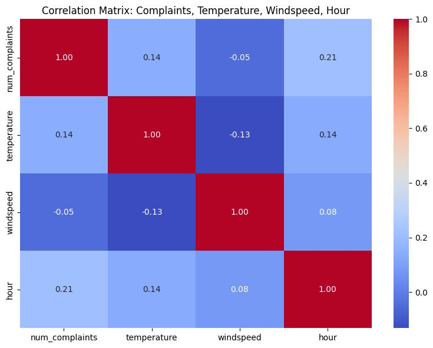
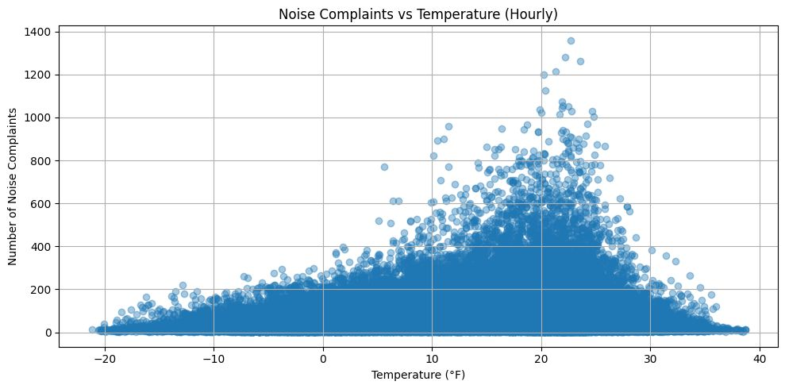
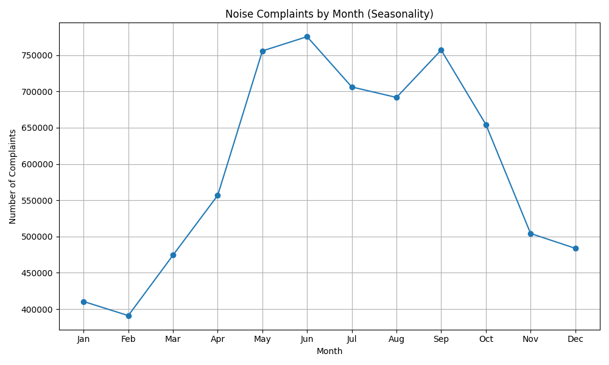
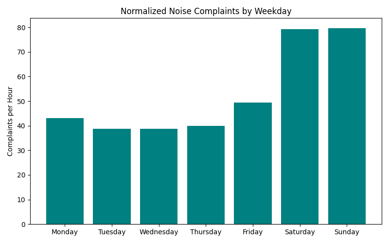
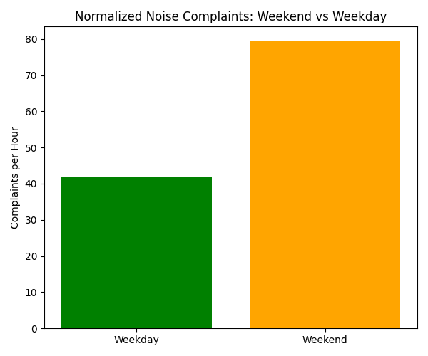
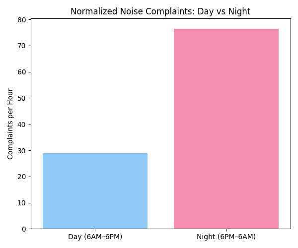
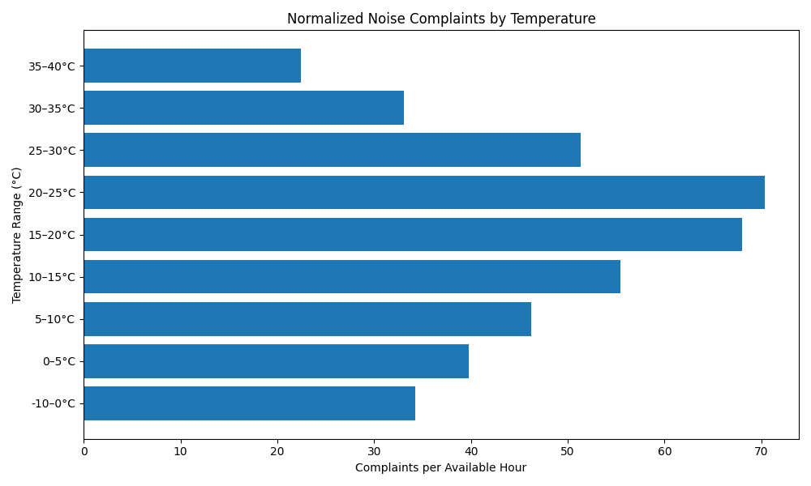
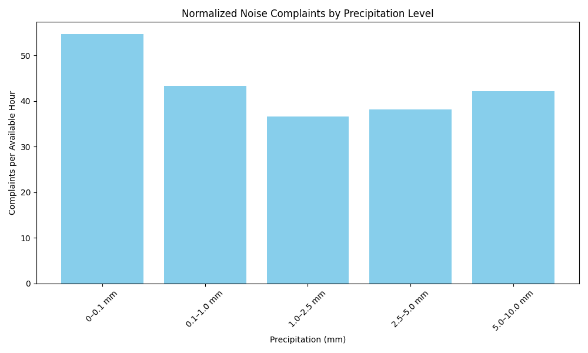
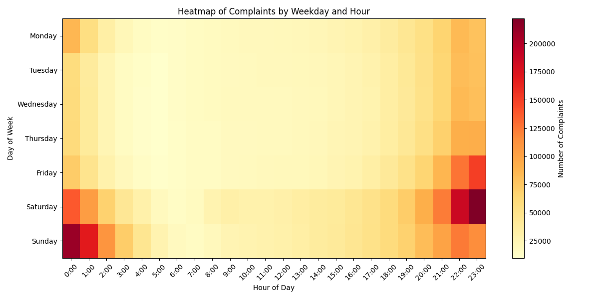
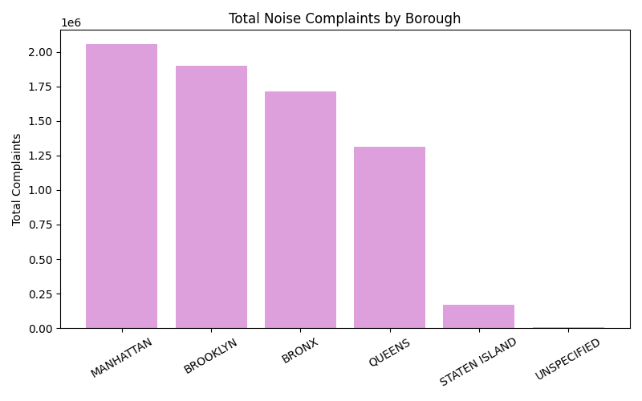

# 📘 IA626 Final Project: Weather vs Noise Complaints in NYC (2010–2025)
---
##  Overview
This project investigates the relationship between **weather conditions** (temperature, wind speed, precipitation) and **noise complaint patterns** in **NYC**. The purpose is to understand how external environmental factors influence the volume of noise-related 311 service requests in a specific urban area.

---
## 🧠 Hypothesis

Noise complaint volume is likely to be influenced by environmental conditions.  
We hypothesized:

> **“Noise complaints in NYC increase in warmer and dry weather, particularly during weekends and evening hours.”**

---
## 🎯 Objective

To investigate the correlation between hourly weather conditions and 311 noise complaints in NYC using two publicly available datasets:
1. 311 Service Requests (filtered for noise-related complaints)
2. Hourly historical weather data for Central Park, NYC

---

## Tools Used

- csv - For handling large files efficiently  
- datetime - For parsing and aligning timestamps  
- collections.defaultdict - For binning counts  
- requests - For calling Open-Meteo API  
- matplotlib, seaborn - For visualizations

## 📁 Data Sources

### 1. 🏙️ NYC 311 Noise Complaint Data
- **Source:** [NYC Open Data Portal](https://data.cityofnewyork.us/)
- **Coverage:** January 2010 to Present
- **Complaint Type:** Only entries containing `"Noise"`
- **ZIP Codes Used for Filtering:**
  - Manhattan: 10027, 10025, 10031
  - Brooklyn: 11201
  - Bronx: 10451
- **Download Instructions:**
  1. Filter by `Complaint Type` → `contains` → `"Noise"`
  2. Filter by `Incident Zip` → `is one of` → 10027, 11201, 10451, 10031, 10025
  3. Export the filtered dataset as CSV
- **File:** `311_Service_Requests.csv`
- **Rows:** ~7.3 million
  
### 2. Hourly Historical Weather Data
- **Source:** [Open-Meteo Historical API](https://open-meteo.com/)
- **Endpoint:** `https://archive-api.open-meteo.com/v1/archive`
- **Location:** Central Park (Lat: 40.78, Lon: -73.97)
- **Format:** JSON → CSV
- **Parameters Used:**
  - `temperature_2m` (°C)
  - `precipitation` (mm)
  - `wind_speed_10m` (m/s)
- **Hourly granularity from** `2010-01-01` to present
- **Challenge:** We began using the default Open-Meteo API, which initially only allowed retrieval of hourly data for the current or previous day — not suitable for our long-term analysis.
- **Solution:** We switched to the Open-Meteo Archive API, which:
  - Supports historical hourly weather data from 2010
  - Is free and open (no API key needed)
  - Accepts queries for specific variables like:
      - temperature_2m
      - precipitation
      - wind_speed_10m
  - We used a Python script with the requests module to loop through each 30-day period, fetching hourly data in manageable chunks and writing it to a CSV file.

- **File:** `hourly_weather.csv`
- **Rows:** <b><i> 135,888</i></b>
---
---

## 🔧 Weather Data Retrieval (API Logic)

```python
import requests, csv
from datetime import datetime, timedelta

start_date = datetime(2010, 1, 1)
end_date = datetime(2025, 1, 1)
url = "https://archive-api.open-meteo.com/v1/archive"

with open("hourly_weather.csv", "w", newline="") as file:
    writer = csv.writer(file)
    writer.writerow(["datetime", "temperature_2m", "precipitation", "wind_speed_10m"])

current = start_date
while current < end_date:
    chunk_start = current
    chunk_end = min(current + timedelta(days=30), end_date)
    
    params = {
        "latitude": 40.78,
        "longitude": -73.97,
        "start_date": chunk_start.strftime("%Y-%m-%d"),
        "end_date": chunk_end.strftime("%Y-%m-%d"),
        "hourly": "temperature_2m,precipitation,wind_speed_10m",
        "timezone": "America/New_York"
    }

    response = requests.get(url, params=params)
    if response.status_code == 200:
        data = response.json()
        for i in range(len(data['hourly']['time'])):
            writer.writerow([
                data['hourly']['time'][i],
                data['hourly']['temperature_2m'][i],
                data['hourly']['precipitation'][i],
                data['hourly']['wind_speed_10m'][i]
            ])
    current += timedelta(days=30)
```

---

## Merging Strategy

To combine weather data with 311 complaints:
- Parsed the `Created Date` from each 311 record
- Floored each datetime to the nearest hour using:

```python
created_time = datetime.strptime(row['Created Date'], '%m/%d/%Y %I:%M:%S %p')
created_time = created_time.replace(minute=0, second=0)
```

- Weather data was loaded into a dictionary using timestamps as keys:

```python
weather_dict = {datetime.strptime(row['datetime'], '%Y-%m-%dT%H:%M'): row for row in weather_data}
```

- 311 data was streamed line-by-line and matched with weather conditions:

```python
if created_time in weather_dict:
    enriched_row = {
        'datetime': created_time,
        'complaint_type': row['Complaint Type'],
        'temperature': weather_dict[created_time]['temperature_2m'],
        'precipitation': weather_dict[created_time]['precipitation'],
        'windspeed': weather_dict[created_time]['windspeed_10m']
    }
    merged_data.append(enriched_row)
```

- Final merged file: `311_weather_merged1.csv`  
- Total merged rows: <i>**7,160,853**</i>
---

## Normalization Strategy

In our early analysis, we visualized the **raw count of complaints** for various weather and time-based categories. After meeting with professor, we realized that this was misleading: certain weather conditions (e.g., 20-25°C temperatures or no rainfall) occur far more frequently than others (e.g., 35-40°C or heavy rain). As a result, their higher complaint totals were simply a reflection of **more hours**, not necessarily more noise.

To make the comparisons meaningful, we applied **normalization**, converting raw complaint counts into **complaints per available hour** for each category.

### Formula Used:
```
Normalized Complaints = Total Complaints / Available Hours
```

We used this strategy in all our major breakdowns:

| Analysis Type     | Normalized By                            |
|-------------------|-------------------------------------------|
| Temperature Range | Number of hourly entries in each bin      |
| Precipitation     | Number of hours with that rain level      |
| Day vs Night      | Total day and night hours available       |
| Weekdays          | Total number of hourly records per day    |
| Boroughs          | Assumed equal weather coverage for all    |

This allowed us to identify **complaint density** (per hour) rather than total volume, eliminating bias caused by unequal time coverage. For instance, although 35-40°C had fewer complaints, it also had far fewer hours — so when normalized, it gave an accurate picture of noise intensity during hot weather.

> The result is a **fair, unbiased comparison** across weather conditions, times of day, and locations.

---
## 📏 Example Code for Temperature Normalization

```python
from collections import defaultdict
import csv
from datetime import datetime

temp_buckets = {
    "-10–0": ( -10, 0),
    "0–5":   ( 0, 5),
    "5–10":  ( 5, 10),
    "10–15": (10, 15),
    "15–20": (15, 20),
    "20–25": (20, 25),
    "25–30": (25, 30),
    "30–35": (30, 35),
    "35–40": (35, 40)
}

bucket_hours = defaultdict(int)
bucket_complaints = defaultdict(int)

with open("hourly_weather.csv", "r") as f:
    reader = csv.DictReader(f)
    for row in reader:
        try:
            temp = float(row["temperature_2m"])
            for label, (low, high) in temp_buckets.items():
                if low <= temp < high:
                    bucket_hours[label] += 1
        except:
            continue

with open("311_weather_merged1.csv", "r") as f:
    reader = csv.DictReader(f)
    for row in reader:
        try:
            temp = float(row["temperature_2m"])
            for label, (low, high) in temp_buckets.items():
                if low <= temp < high:
                    bucket_complaints[label] += 1
        except:
            continue

print("\n📊 Normalized Complaints per Available Hour (by Temperature):")
for label in temp_buckets:
    complaints = bucket_complaints[label]
    hours = bucket_hours[label]
    rate = complaints / hours if hours > 0 else 0
    print(f"{label:>7}: {complaints} complaints / {hours} hours = {rate:.2f} per hour")
```

---

##  ETL Pipeline

### Extract
- NYC 311 data downloaded as CSV
- Weather data pulled using Python from the Open-Meteo archive API, 30 days at a time

### Transform
- 311 `Created Date` converted to datetime and rounded to the hour
- Weather `datetime` field also converted and matched to the same hour format
- Both datasets filtered and joined on `datetime` key
- Final dataset structured with:
  - `datetime`, `num_complaints`, `temperature`, `precipitation`, `windspeed`

### Load
- **Intermediate Output:** `311_weather_merged1.csv` (7.16M rows)
- **Final Output:** `hourly_summary_311_weather.csv`

---

## Analysis & Visualizations

### 1. Correlation Matrix


| Variable     | Correlation with Complaints |
|--------------|-----------------------------|
| Temperature  | +0.14                        |
| Windspeed    | -0.05                        |
| Hour         | +0.07                        |

- **Hour of day** shows slight correlation, aligning with daytime activity.
- The correlation between temperature and complaints is weak but **positive**.
- **Windspeed** and **precipitation** show minimal effect.


### 2.  Scatter Plot - Complaints vs Temperature
This scatter plot compares hourly temperature with the number of noise complaints logged in that same hour.
While the points are quite scattered, there's a slight upward trend — this is confirmed by a correlation coefficient of +0.14, which indicates a weak positive correlation.




Interpretation: Warmer temperatures might slightly increase outdoor activity in NYC, which could explain a rise in noise complaints. However, the effect is not strong, and other factors may also contribute.

---

### 3.Noise Complaints by Month
This line plot illustrates how noise complaint volume fluctuates month to month across the 15-year period (2010-2025).




#### Interpretation:
- Complaint volume is **lowest in winter months**, especially **February**.
- There's a **sharp rise from March through May**, peaking in **June and September**.
- Complaints remain high during **summer and early fall (June-October)**.
- These seasonal trends align with increased **outdoor activity, events, and nightlife** during warmer months, resulting in more noise disruptions.
- Cooler months like **January, February, and December** show the fewest complaints — likely due to reduced outdoor presence and social activity.


---

### 4. Noise Complaints by Weekdays
In this visualization, we calculated the average number of complaints and temperature per day. The light gray bars represent weekend dates.
From the chart, we observe that weekends often have slightly higher complaint rates, especially when paired with warmer weather.



This chart shows the average number of noise complaints per hour for each day of the week, normalized to account for the total number of available hourly data points per day (from 2010 to 2025).

####  Interpretation:
- **Saturday and Sunday** have the **highest complaint rates**, averaging close to **80 complaints per hour**, even after normalization.
- **Friday** also shows a noticeable rise in complaints, likely due to the start of weekend social activities.
- **Weekdays (Monday–Thursday)** have significantly lower rates (around 38–44 complaints per hour), reflecting reduced nightlife and quieter behavior during workdays.
- The consistency of these trends after normalization confirms that **human behavior, especially during weekends, is a major driver of urban noise in NYC.**
---
### 5. Weekends vs Weekdays- Compalint Comparison

This chart compares the normalized number of noise complaints per hour between **weekdays (Monday to Friday)** and **weekends (Saturday and Sunday)**.

#### Interpretation:
- ** Weekend complaint rate (~79 per hour)** is nearly **double** that of the **weekday rate (~42 per hour)**.
- This significant increase on weekends remains clear even after normalization, proving that it's not just due to time coverage but actual behavioral patterns.
- Factors likely contributing to weekend spikes:
  - Increased **social gatherings**, **parties**, and **outdoor events**
  - More **free time** and nightlife activity
  - People being more sensitive to noise while resting at home


---
### 5. Day vs Night - Complaint Comparison


- **Nighttime** shows a significantly higher average of ~**76 complaints per hour**, compared to only ~**29 during daytime**.
- This dramatic difference persists even after normalization, proving that **noise activity in NYC is predominantly a nighttime issue**.
- Likely contributing factors include:
  - Social events, nightlife, bars, and gatherings
  - Increased sensitivity to noise at night when residents expect quiet

---
### 6. Noise Complaints by Temperature


This horizontal bar chart displays the average number of complaints per available hour for different temperature bands (in °C).

#### Interpretation:
- The **20-25°C** range has the **highest normalized complaint rate**, followed closely by **15-20°C**.
- Complaint frequency remains relatively high between **10°C and 30°C**, suggesting that **moderate-to-warm weather promotes outdoor activity**, gatherings, and potentially more noise.
- The lowest complaint densities are seen in the **coldest (-10-0°C)** and **hottest (35-40°C)** ranges — likely because both extremes discourage outdoor presence.
- This trend holds true even after adjusting for how often each temperature range occurred.


---
### 7. Noise Complaints by Preciptation

The bar chart below shows the average number of complaints per hour for different levels of precipitation (rainfall), normalized using the total available hours for each range. 


This bar chart shows the average number of complaints per hour for different levels of precipitation (rainfall), normalized using the total available hours for each range.

####  Interpretation:
- The **0-0.1 mm** range has the **highest complaint rate**, indicating that noise complaints are most frequent during **dry or near-dry conditions**.
- Complaint frequency declines as rainfall increases, reaching the **lowest** in the **1.0–2.5 mm** range.
- Interestingly, there's a slight increase again for heavier rain (5.0–10.0 mm), but it remains lower than dry hours.
- This suggests that **rain generally acts as a suppressor of outdoor noise activity**, possibly due to reduced human movement, events, and vehicle flow.
---
 ### 8. Heatmap by weekend and hour
 

This heatmap visualizes the volume of noise complaints across all days of the week and hours of the day.

#### Interpretation:
- The most intense complaints occur between **9 PM and 2 AM**, particularly on **Friday, Saturday, and Sunday**.
- **Sunday early morning (12:00 AM-2:00 AM)** shows the darkest red zones, indicating the **highest complaint density** — likely due to late Saturday night activities.
- **Weekday daytime hours (8 AM-6 PM)** show very few complaints across the board.
- This pattern aligns with behavioral cycles — **nightlife activity peaks on weekends**, which leads to increased noise and subsequently more 311 complaints.

---
### 9. Geographical Insight: Complaints by Borough



This bar chart displays the **total number of noise complaints** recorded in each NYC borough from 2010 to 2025.

#### 📌 Interpretation:
- **Manhattan** and **Brooklyn** show the highest number of complaints, followed by **Bronx** and **Queens**.
- **Staten Island** reports the least complaints, which aligns with its lower population density and less active nightlife scene.
- This chart uses **raw complaint totals**, not normalized values, as boroughs vary significantly in population and comparing per-hour values may be misleading.

---
## 📌 Final Conclusion

Our comprehensive analysis of NYC's 311 noise complaint data, when merged with historical hourly weather data from Central Park (2010–2025), confirms that **noise levels in the city are significantly influenced by environmental and temporal factors**.

The **highest complaint rates** were observed during **warm, dry nights on weekends**, especially between **10 PM and 2 AM**. Specifically, the temperature range **20–25°C** and dry conditions (<0.1 mm precipitation) showed the most noise complaints per hour, aligning with the hypothesis that **favorable weather encourages outdoor activities**, leading to more urban noise.

Additionally, **weekends (Saturday and Sunday)** consistently showed higher complaint rates, both in raw and normalized terms, indicating that **human behavioral cycles like nightlife and social gatherings** are key contributors to noise pollution. The weekday-hour heatmap further reinforced this, with **Sunday early morning (post Saturday night)** showing peak disturbance.

From a geographical perspective, **Manhattan and Brooklyn** reported the highest normalized complaint rates, reflecting their **higher population density**, **commercial activity**, and **vibrant nightlife** compared to other boroughs like **Staten Island**, which reported the least.

Our month-wise seasonal analysis demonstrated that **noise complaints are strongly seasonal**, with peaks from **late spring through early fall (May to October)**, and a noticeable drop during **winter months**, particularly in **February**.

> ✅ These findings confirm our initial hypothesis:  
> **Urban noise in NYC is more prevalent during warm, dry weekends — especially late at night — and is driven largely by human activity patterns.**

This project not only demonstrates the effectiveness of combining public datasets via structured ETL pipelines, but also shows how **normalization techniques are crucial** for drawing fair insights across time-based and weather-based categories.

---

